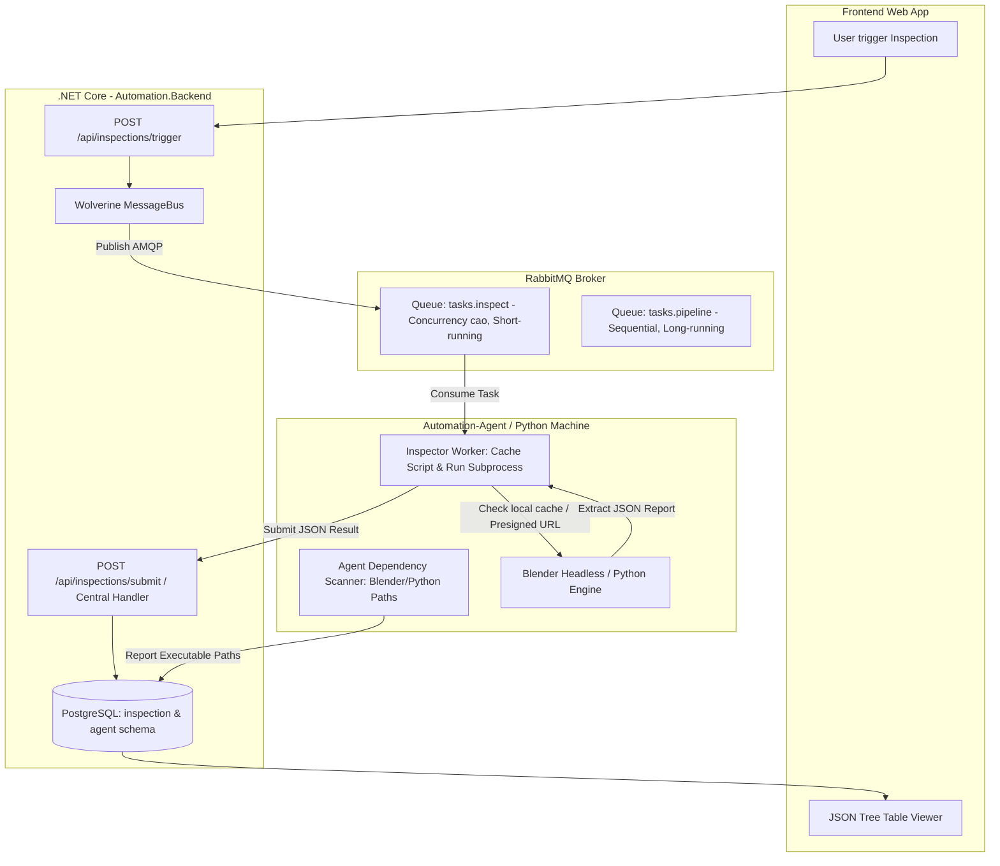

# Kế hoạch triển khai: Module Inspection & Auto-Inspection Pipeline

## 📌 Tổng quan
Tài liệu này xác lập kế hoạch chi tiết để xây dựng hệ thống **Inspection** cho các Resource trong Project. Hệ thống cho phép:
1. Quản lý các **Inspector** và script phiên bản (lưu trữ trên Cloud qua module `Files`).
2. Thiết lập quy tắc tự động hóa (**Inspector Rules**) theo Project & định dạng file (PlatformExtension/ContentType).
3. Điều phối lệnh kiểm tra từ Server xuống **Agent** thông qua **RabbitMQ + Wolverine** (hàng đợi `tasks.inspect` độc lập với pipeline nặng).
4. Tiếp nhận kết quả kiểm tra dạng JSON động qua **Centralized Ingestion Handler**.
5. Hiển thị báo cáo chi tiết trên Frontend bằng giao diện **Resource Detail Modal (Lịch sử Version dạng Card + Kết quả Inspection dạng JSON Tree Table kết hợp Sub-Table)**.
6. **Agent Dependency Auto-Scan**: Tự động phát hiện phiên bản và đường dẫn các phần mềm (Blender, Python, DCC tools) trên máy trạm Agent để điều phối job chính xác.

---

## 🏗️ 1. Thiết kế Kiến trúc & Cơ chế Giao tiếp



---

## 💡 2. Gợi ý Giải pháp: Agent Dependency Auto-Scan (Blender, Python, DCC Tools)

Để Server biết Agent nào đủ điều kiện nhận job Inspection (ví dụ file `.blend` cần máy có Blender 4.2+):

### A. Cơ chế quét tự động trên Agent (`commands/detect_environment.py`):
1. **Windows Registry Scanning:**
   - Đọc các key: `HKLM\SOFTWARE\Blender Foundation\Blender`, `HKLM\SOFTWARE\Python\PythonCore`, `HKLM\SOFTWARE\Autodesk\Maya`.
2. **System PATH & Standard Directories:**
   - Quét các thư mục mặc định: `C:\Program Files\Blender Foundation\Blender *\blender.exe`, `C:\Program Files\Python3*\python.exe`, macOS `/Applications/Blender.app`, Linux `/usr/bin/blender`.
3. **Silent CLI Version Verification:**
   - Chạy lệnh ngầm: `blender.exe --version` hoặc `python.exe --version` để trích xuất exact semantic version (VD: `4.2.1`).
4. **Báo cáo về Server:**
   - Khi Agent khởi động hoặc khi ấn nút "Scan Dependencies" trên web, Agent gửi mảng `PlatformConfigs` về Server để lưu vào bảng `AgentPlatformConfigs`:
     ```json
     [
       { "platformKey": "blender", "version": "4.2.1", "executablePath": "C:\\Program Files\\Blender Foundation\\Blender 4.2\\blender.exe" },
       { "platformKey": "python", "version": "3.11.9", "executablePath": "C:\\Python311\\python.exe" }
     ]
     ```

---

## 🗄️ 3. Chi tiết Thay đổi Domain & Database Backend

### `Automation.Inspection` Module:

#### [MODIFY] `Inspector.cs`
- Thêm `public Guid ProjectId { get; private set; }` để gắn Inspector với từng Project.

#### [MODIFY] `InspectorVersion.cs`
- Thêm `public Guid ScriptAssetId { get; private set; }` (liên kết với module `Files`/`Asset`).
- Thêm `public string ScriptHash { get; private set; }` (SHA-256 để Agent so sánh cache local).
- Lưu giữ `EntryPoint` (tên file hoặc class thực thi).

#### [MODIFY] `Inspection.cs`
- Chuyển sang trỏ trực tiếp vào **`ResourceVersionId`**:
  ```csharp
  public class Inspection : BaseEntity<Guid>
  {
      public Guid ResourceVersionId { get; private set; }
      public Guid InspectorVersionId { get; private set; }
      public InspectorVersion InspectorVersion { get; private set; } = null!;
      public InspectionStatus Status { get; private set; } // Passed, Warning, Failed
      public JsonDocument Data { get; private set; } = null!; // Dynamic JSON payload
      public long ExecutionTimeMs { get; private set; }
      public string? SummaryMessage { get; private set; }
      public DateTimeOffset InspectedAt { get; private set; }
  }
  ```

#### [MODIFY] `InspectorRule.cs`
- Giữ nguyên quan hệ giữa `ProjectId`, `PlatformExtensionId`, `InspectorId`, `ContentTypeId`, `Enabled`.

---

## 🔌 4. Thiết kế API Endpoints (Backend)

### A. Quản lý Inspector (`/api/projects/{projectId}/inspectors`)
- `GET /api/projects/{projectId}/inspectors`: Danh sách inspector trong project.
- `POST /api/projects/{projectId}/inspectors`: Tạo inspector mới.
- `GET /api/inspectors/{id}`: Chi tiết inspector kèm các versions.
- `POST /api/inspectors/{id}/versions`: Tạo version mới cho inspector (upload script file).

### B. Inspector Rules (`/api/projects/{projectId}/inspector-rules`)
- `GET /api/projects/{projectId}/inspector-rules`: Danh sách rule của project.
- `POST /api/projects/{projectId}/inspector-rules`: Gán inspector cho extension/content type.
- `PUT /api/projects/{projectId}/inspector-rules/{id}`: Bật/tắt hoặc sửa rule.
- `DELETE /api/projects/{projectId}/inspector-rules/{id}`: Xóa rule.

### C. Trigger & Centralized Ingestion
- `POST /api/inspections/trigger`: Nhận `resourceVersionIds` (hoặc `resourceIds`), tự resolve rule, publish task lên RabbitMQ (`tasks.inspect`).
- `POST /api/inspections/submit`: **Centralized Handler** tiếp nhận kết quả từ Agent và lưu `JsonDocument` vào DB.

### D. Truy vấn Kết quả Inspection
- `GET /api/resource-versions/{resourceVersionId}/inspections`: Lấy danh sách kết quả inspection của một version file cụ thể.
- `GET /api/inspections/{id}`: Xem chi tiết raw JSON data của một bản ghi inspection.

---

## 🐍 5. Triển khai Python Agent (`Automation-Agent`)

1. **Thêm module `worker/inspector_worker.py`:**
   - Lắng nghe queue `tasks.inspect` trên RabbitMQ.
   - Nhận payload gồm: `task_id`, `resource_path`, `script_url`, `script_hash`, `executable_path`.
   - **Thuật toán Cache Script:** Kiểm tra folder `~/.automation/cache/scripts/{hash}`: nếu có thì dùng ngay, chưa có thì tải từ `script_url`.
   - Chạy script qua subprocess headless:
     ```bash
     "C:\Program Files\Blender Foundation\Blender 4.2\blender.exe" -b --python script.py -- --file "path/to/model.blend"
     ```
   - Đọc kết quả stdout (hoặc output json file) và gọi `POST /api/inspections/submit`.

---

## 🖥️ 6. Thiết kế Giao diện Frontend (UI/UX)

### A. Modal / Trang Chi tiết Resource (`ResourceDetailModal.tsx`):
- **Header:** Tên file, dung lượng, platform tag, content tag, workspace path.
- **Tab 1: Lịch sử Versions (Phiên bản):**
  - Card Accordion hiển thị từng Version (Latest tự động mở, các version cũ thu gọn).
  - Chi tiết nguồn gốc push từ Local Agent (Tên máy, IP, OS, đường dẫn local gốc).
  - Danh sách các node Agent khác đã đồng bộ (Locations status).
- **Tab 2: Kết quả Inspections:**
  - **Version selector pills:** Chọn xem báo cáo của version `v3 (Current)`, `v2`, `v1`...
  - **Inspector Cards:**
    - Header: Tên Inspector, badge status (`Passed` / `Warning` / `Failed`), execution time, dropdown chọn phiên bản inspector, nút **Copy JSON**.
    - Summary alert banner: Tóm tắt số lượng rules đạt/không đạt.
    - **`JsonTreeTable` Component:**
      - Hiển thị cấu trúc cây lồng nhau (Object expandable).
      - **Tự động chuyển mảng object thành Sub-Table** (ví dụ `material_slots` thành bảng có các cột `slot_index`, `material_name`, `shader_type`, `textures_count`).

---

## 📅 7. Kế hoạch Thực hiện theo từng Phase

- [ ] **Phase 1: Backend Domain & Database Migration**
  - Cập nhật Entities `Inspector`, `InspectorVersion`, `Inspection`.
  - Tạo EF Core Migration cho module `Inspection`.
- [ ] **Phase 2: Wolverine RabbitMQ Integration & Centralized Handler**
  - Cấu hình Wolverine RabbitMQ Transport với queue `tasks.inspect`.
  - Viết `TriggerInspectionEndpoint` và `SubmitInspectionResultEndpoint`.
- [ ] **Phase 3: Agent Worker & Dependency Detection**
  - Thêm script quét phần mềm cài đặt (`Blender`, `Python`).
  - Xây dựng `inspector_worker.py` xử lý tải script, chạy subprocess và trả JSON.
- [ ] **Phase 4: Frontend Resource Detail Modal & JSON Tree Table**
  - Xây dựng component `JsonTreeTable` hỗ trợ Sub-Table cho array objects.
  - Xây dựng `ResourceDetailModal` với 2 Tab (Lịch sử Version & Kết quả Inspection).
- [ ] **Phase 5: Kiểm thử Toàn trình & Tối ưu**
  - Chạy thử nghiệm trọn vẹn từ lúc trigger trên Web -> RabbitMQ -> Agent chạy Blender Inspector -> Ingestion DB -> Xem kết quả trên Web.
