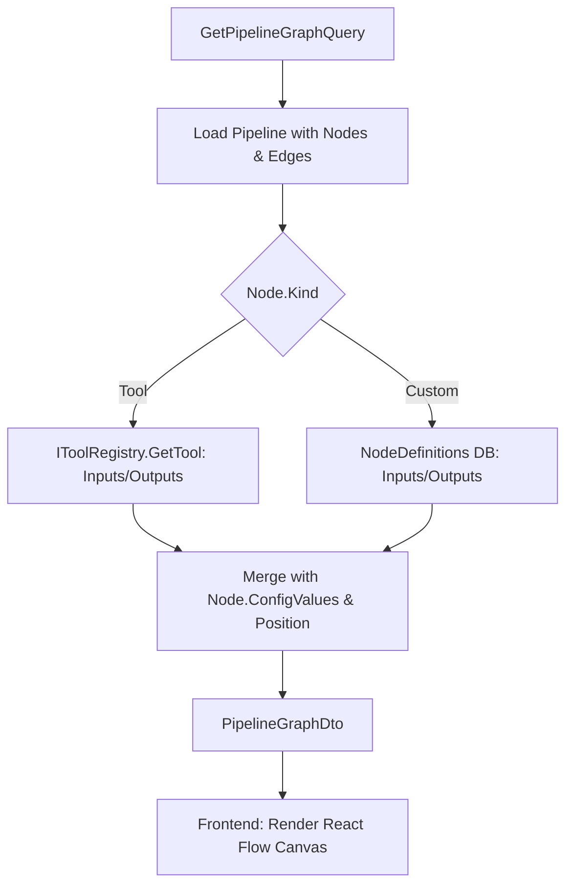
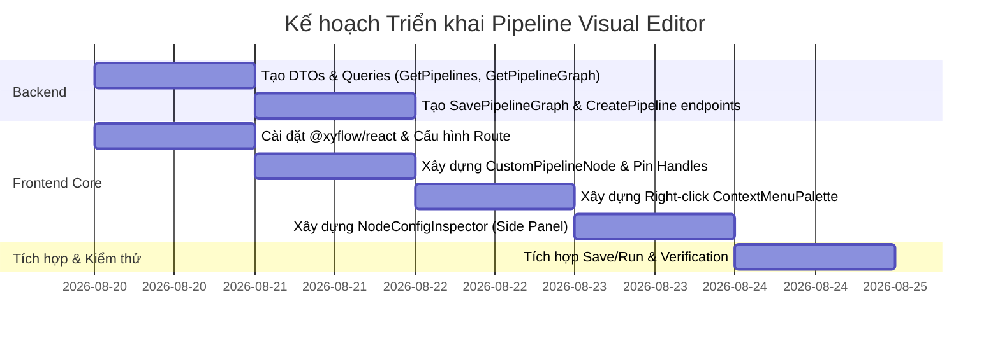

# Kế hoạch triển khai Visual Pipeline Editor với React Flow

Tài liệu thiết kế kiến trúc và kế hoạch triển khai trang **Visual Pipeline Editor** sử dụng thư viện `@xyflow/react` (React Flow v12) kết nối với Backend `Automation.Pipeline`.

---

## 1. Phân tích Hiện trạng & Yêu cầu DTO Thống Nhất

### Vấn đề hiện tại:
- Thực thể `PipelineNode` trong database chỉ lưu `RefId`, `Kind`, `Position (x, y)` và `Config (jsonb)`.
- Nếu Frontend tự đi fetch `ToolRegistry` và `NodeDefinitions` riêng lẻ rồi tự ghép nối (client-side stitching) thì sẽ tốn nhiều roundtrip và dễ bị lệch schema.
- **Giải pháp tối ưu**: Backend cung cấp endpoint `GetPipelineGraph` trả về **`PipelineGraphDto` hợp nhất**. Backend tự động phân giải `Kind == "Tool"` hoặc `Kind == "Custom"` để nhúng sẵn danh sách `Inputs` & `Outputs` Pins vào từng Node DTO.



---

## 2. Thiết kế DTO & API Backend (`Automation.Pipeline`)

### 2.1. Các DTO hợp nhất
```csharp
public record PipelineNodeGraphDto(
    Guid Id,
    string RefId,
    string Kind,             // "Tool" | "Custom"
    string Label,
    string? Category,
    string? Executor,        // "csharp" | "blender" | "python"
    NodePosition Position,   // { X, Y }
    IReadOnlyList<PinDefinition> Inputs,
    IReadOnlyList<PinDefinition> Outputs,
    Dictionary<string, object?>? ConfigValues
);

public record PipelineEdgeGraphDto(
    Guid Id,
    Guid SourceNodeId,
    string SourcePin,
    Guid TargetNodeId,
    string TargetPin
);

public record PipelineGraphDto(
    Guid Id,
    Guid ProjectId,
    string Name,
    IReadOnlyList<PipelineNodeGraphDto> Nodes,
    IReadOnlyList<PipelineEdgeGraphDto> Edges
);
```

### 2.2. Các Endpoint CRUD & Graph
1. `GET /api/pipeline?projectId={projectId}` (`GetPipelinesEndpoint`): Danh sách pipelines của project.
2. `POST /api/pipeline` (`CreatePipelineEndpoint`): Tạo một pipeline rỗng.
3. `GET /api/pipeline/{id}/graph` (`GetPipelineGraphEndpoint`): Trả về `PipelineGraphDto` đã nạp đầy đủ pins schema.
4. `PUT /api/pipeline/{id}/graph` (`SavePipelineGraphEndpoint`): Lưu toàn bộ Nodes (Position + ConfigValues) và Edges.
5. `POST /api/pipeline/{id}/run` (`RunPipelineEndpoint`): Kích hoạt chạy pipeline.

---

## 3. Thiết kế Kiến trúc Frontend (`Automation-Frontend`)

### 3.1. Cài đặt thư viện
- Cài đặt `@xyflow/react` (bản React Flow mới nhất hỗ trợ React 19).

### 3.2. Cấu trúc Component
```text
src/features/pipelines/
├── hooks/
│   ├── usePipelines.ts                       # Custom hooks cho palette & custom nodes
│   └── usePipelineGraph.ts                   # Custom hooks: usePipelineGraph, useSavePipelineGraph, useRunPipeline
├── components/
│   ├── canvas/
│   │   ├── PipelineCanvas.tsx                # Khung ReactFlow Canvas chính
│   │   ├── CustomPipelineNode.tsx            # Node component với Handles (Input/Output Pins + PinBadges)
│   │   ├── ContextMenuPalette.tsx            # Popover menu khi click chuột phải trên canvas để add node
│   │   ├── CanvasControls.tsx                # Nút Zoom, FitView, MiniMap, Save, Run
│   │   └── NodeConfigInspector.tsx           # Side Panel bên phải cấu hình literal input values cho node được chọn
│   └── PipelineList.tsx                      # Trang danh sách các Pipeline của Project
└── pages/
    ├── PipelineListPage.tsx                  # /projects/$projectId/pipelines
    └── PipelineEditorPage.tsx                # /projects/$projectId/pipelines/$pipelineId
```

---

## 4. Chi tiết Cơ chế Tương tác (Interaction Flow)

### 4.1. Click Chuột Phải $\to$ Mở Quick Search Palette
- Khi người dùng click chuột phải lên canvas (`onContextMenu` / `onPaneContextMenu`):
  1. Ngăn menu mặc định của trình duyệt (`e.preventDefault()`).
  2. Lấy tọa độ canvas thực tế bằng `screenToFlowPosition({ x: e.clientX, y: e.clientY })`.
  3. Mở popover menu với ô tìm kiếm nhanh (filter qua toàn bộ Built-in Tools & Custom Nodes từ `useNodePalette`).
  4. Khi chọn 1 Tool/Node: lập tức tạo 1 Node mới tại tọa độ chuột, sinh GUID ngẫu nhiên và add vào React Flow state.

### 4.2. Kéo Thả Nối Dây (Edges & Type Validation)
- Output Handle bên phải nối sang Input Handle bên trái.
- Tự động kiểm tra tương thích kiểu dữ liệu (hoặc highlight handle khi đang drag dây).

### 4.3. Click Chọn Node $\to$ Mở Side Panel Cấu hình Giá trị (Config Inspector)
- Khi click chọn 1 node:
  - Cột bên phải mở ra danh sách toàn bộ Input Pins của Node đó.
  - **Nếu Pin ĐANG ĐƯỢC NỐI DÂY**: Hiển thị badge *"Connected from [SourceNode].[Pin]"* (disabled input).
  - **Nếu Pin CHƯA ĐƯỢC NỐI DÂY (Unwired)**: Hiển thị form control tương ứng theo kiểu dữ liệu (`Number`, `String`, `Boolean Switch`, `Entity Picker`, `Path`) để người dùng nhập giá trị tĩnh trực tiếp (Static Literal Value). Giá trị này được lưu vào `node.data.configValues[pin.id]`.

### 4.4. Nút Lưu (Save) & Chạy (Run)
- Bấm **"Save Graph"**: Đồng bộ React Flow state $\to$ Gửi payload `SavePipelineGraphCommand` lên Backend.
- Bấm **"Run Pipeline"**: Kích hoạt `RunPipelineCommand` và chuyển sang chế độ theo dõi log realtime (polling execution status).

---

## 5. Kế hoạch Triển khai Chi tiết



---

## 6. Kế hoạch Kiểm tra (Verification Plan)

### Kiểm tra Tự động & Build:
- Backend: `dotnet build` bảo đảm 0 lỗi, 0 warnings.
- Frontend: `pnpm run gen:api` sinh API models mới và `pnpm tsc -b` kiểm tra 100% type-safe.

### Kiểm tra Luồng Người dùng (Manual Verification):
1. Vào `/projects/{projectId}/pipelines` $\to$ Tạo pipeline mới.
2. Mở canvas $\to$ Chuột phải $\to$ Tìm "SyncLocalChangeToWorkspace" $\to$ Add node vào canvas.
3. Chuột phải $\to$ Add thêm 1 Custom Node.
4. Nối dây giữa 2 node.
5. Click chọn Node $\to$ Nhập giá trị ở Side Panel bên phải.
6. Bấm **Save Pipeline** $\to$ F5 tải lại trang $\to$ Toàn bộ vị trí, dây nối và cấu hình input được giữ nguyên vẹn.
